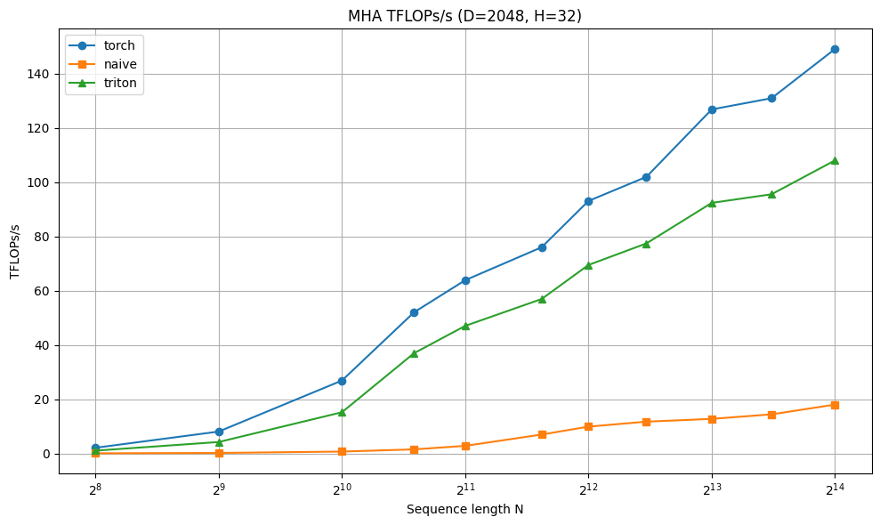

# Flash-Attention-with-Triton

This repository contains an implementation of the FlashAttention algorithm written in OpenAI Triton.

## Overview of FA2

FlashAttention-2 computes exact attention without materializing the full N×N attention matrix in HBM, achieving significant memory savings and speedup through tiling and online softmax.

### Throughput (TFLOPs/s)

<!-- ### Memory Usage

 -->