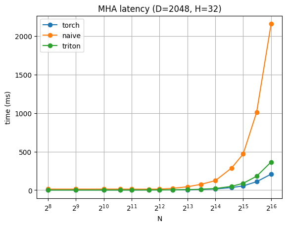
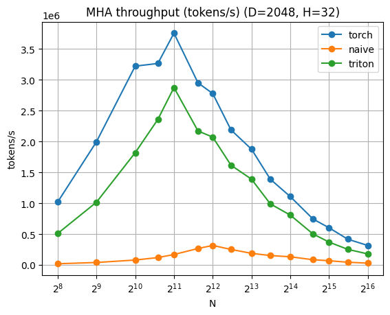
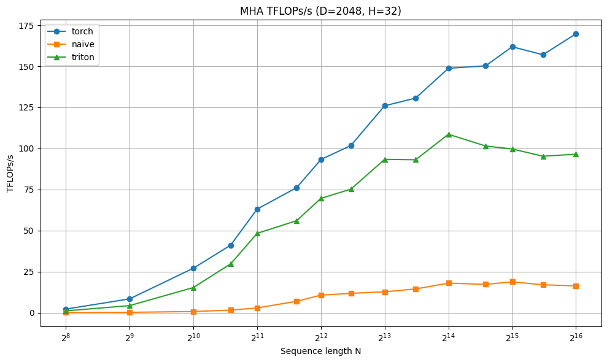

# Flash-Attention-with-Triton


This repository contains a from-scratch implementation of FlashAttention (V1 and V2) using OpenAI's Triton. The project demonstrates the progression from a naive $O(N^2)$ PyTorch attention mechanism to a highly optimized, hardware-aware Triton kernel that leverages tiling, SRAM memory management (limiting data reads/writes from the HBM), and recomputation to drastically reduce memory bandwidth bottlenecks.

## Implementations
1. **Naive Attention (`naive_attention.py`)**: A standard mathematical implementation of scaled dot-product attention. It materializes the full $N \times N$ attention matrix, serving as the baseline for correctness and demonstrating the quadratic memory wall.
2. **FlashAttention V1 (`flash_attention_v1.py`)**: Implements the core online-softmax trick and SRAM tiling. Upgraded with proper tensor strides for PyTorch interoperability.
3. **FlashAttention V2 (`flash_attention_v2.py`)**: Introduces major performance optimizations based on the FlashAttention-2 paper. It reorders the loops to parallelize over Query blocks (rather than iterating them internally), defers non-matmul operations (like scaling) to the end of the loop, and maximizes Streaming Multiprocessor (SM) utilization.

### Throughput (TFLOPs/s)

```text
flash-attention-project/
│
├── requirements.txt
├── naive_attention.py
├── flash_attention_v1.py
├── flash_attention_v1_tiled.py
├── flash_attention_v2.py
├── helpers.py
├── benchmarks.py
├── main.py
└── assets/               # Benchmark plots
    ├── latency.png
    ├── throughput.png
    └── TFLOPS.png

```

Ah, I see exactly what happened. The code blocks inside the README (like the bash and text snippets) were prematurely closing the outer markdown code block, breaking the formatting.

To fix this so you get one perfect, copy-pasteable block, I will wrap the entire README in a four-backtick block. This will safely encapsulate the standard three-backtick blocks inside it.

Here is the complete, single-piece README.md:

Markdown
# Custom FlashAttention in Triton

This repository contains a from-scratch implementation of FlashAttention (V1 and V2) using OpenAI's Triton. The project demonstrates the progression from a naive $O(N^2)$ PyTorch attention mechanism to a highly optimized, hardware-aware Triton kernel that leverages tiling, SRAM memory management, and recomputation to drastically reduce memory bandwidth bottlenecks.

## Implementations
1. **Naive Attention (`naive_attention.py`)**: A standard mathematical implementation of scaled dot-product attention. It materializes the full $N \times N$ attention matrix, serving as the baseline for correctness and demonstrating the quadratic memory wall.
2. **FlashAttention V1 (`flash_attention_v1.py` & `flash_attention_v1_tiled.py`)**: Implements the core online-softmax trick and SRAM tiling. Upgraded with proper tensor strides for PyTorch interoperability.
3. **FlashAttention V2 (`flash_attention_v2.py`)**: Introduces major performance optimizations based on the FlashAttention-2 paper. It reorders the loops to parallelize over Query blocks (rather than iterating them internally), defers non-matmul operations (like scaling) to the end of the loop, and maximizes Streaming Multiprocessor (SM) utilization.

## Project Structure
```text
flash-attention-project/
│
├── requirements.txt
├── naive_attention.py
├── flash_attention_v1.py
├── flash_attention_v1_tiled.py
├── flash_attention_v2.py
├── helpers.py
├── benchmarks.py
├── main.py
└── assets/               # Benchmark plots
    ├── latency.png
    ├── throughput.png
    └── TFLOPS.png
```

## Quick Start
1. Install dependencies:
```bash
pip install -r requirements.txt
```
2. Run the benchmarking suite:
```bash
python main.py
```

## Benchmarks & Performance
Benchmarks were run using `D=2048`, `H=32`, and `dtype=torch.float16` across sequence lengths ($N$) ranging from 256 to 65,536 tokens. 

The custom Triton implementation is compared against the naive PyTorch implementation and PyTorch's native `nn.MultiheadAttention` (which utilizes highly optimized underlying C++ / cuDNN backends).

### Latency
The naive implementation quickly hits the quadratic scaling wall, taking over 2 seconds (2159 ms) to process a 65k context window. The Triton implementation successfully manages memory bounds, handling the same 65k context in just ~364 ms.



### Throughput (Tokens/s)
Triton maintains a highly competitive throughput curve relative to the highly tuned PyTorch native attention, completely dominating the naive approach as sequence lengths scale.



### Compute Utilization (TFLOPs/s)
By V2, the Triton kernel achieves excellent hardware utilization, peaking at nearly 100 TFLOPs/s. It avoids the massive I/O overhead of the naive implementation, keeping the math units fed.



### Raw Benchmark Data
| N | D | H | torch_ms | naive_ms | triton_ms | torch_tflops | naive_tflops | triton_tflops |
|---:|---:|---:|---:|---:|---:|---:|---:|---:|
| 256 | 2048 | 32 | 0.2510 | 12.5080 | 0.5016 | 2.1389 | 0.0429 | 1.0704 |
| 512 | 2048 | 32 | 0.2565 | 12.5255 | 0.5035 | 8.3729 | 0.1714 | 4.2654 |
| 1024 | 2048 | 32 | 0.3178 | 12.6558 | 0.5628 | 27.0295 | 0.6787 | 15.2634 |
| 2048 | 2048 | 32 | 0.5452 | 12.0508 | 0.7123 | 63.0237 | 2.8512 | 48.2374 |
| 4096 | 2048 | 32 | 1.4742 | 12.9151 | 1.9759 | 93.2268 | 10.6417 | 69.5591 |
| 8192 | 2048 | 32 | 4.3647 | 43.3289 | 5.8909 | 125.9536 | 12.6880 | 93.3231 |
| 16384 | 2048 | 32 | 14.7807 | 122.5693 | 20.2484 | 148.7768 | 17.9411 | 108.6024 |
| 32768 | 2048 | 32 | 54.3346 | 469.7367 | 88.2481 | 161.8876 | 18.7256 | 99.6746 |
| 65536 | 2048 | 32 | 207.2219 | 2159.0061 | 364.6677 | 169.7908 | 16.2966 | 96.4834 |

## Validation
All custom implementations are mathematically verified against `torch.nn.MultiheadAttention` using `torch.allclose` to ensure floating-point reordering in the Triton kernel does not break precision requirements.